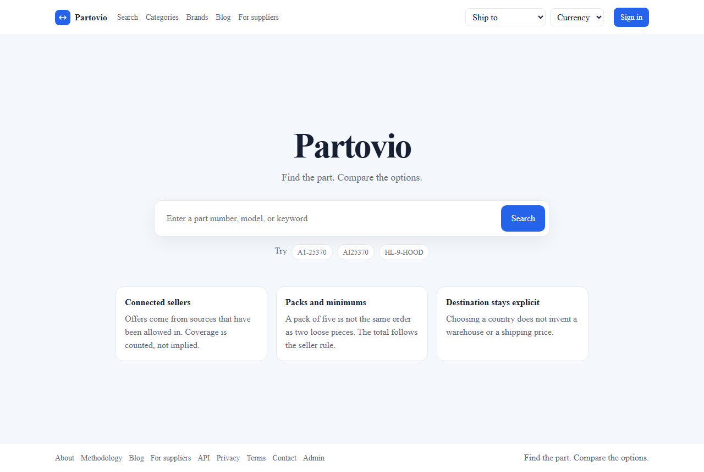
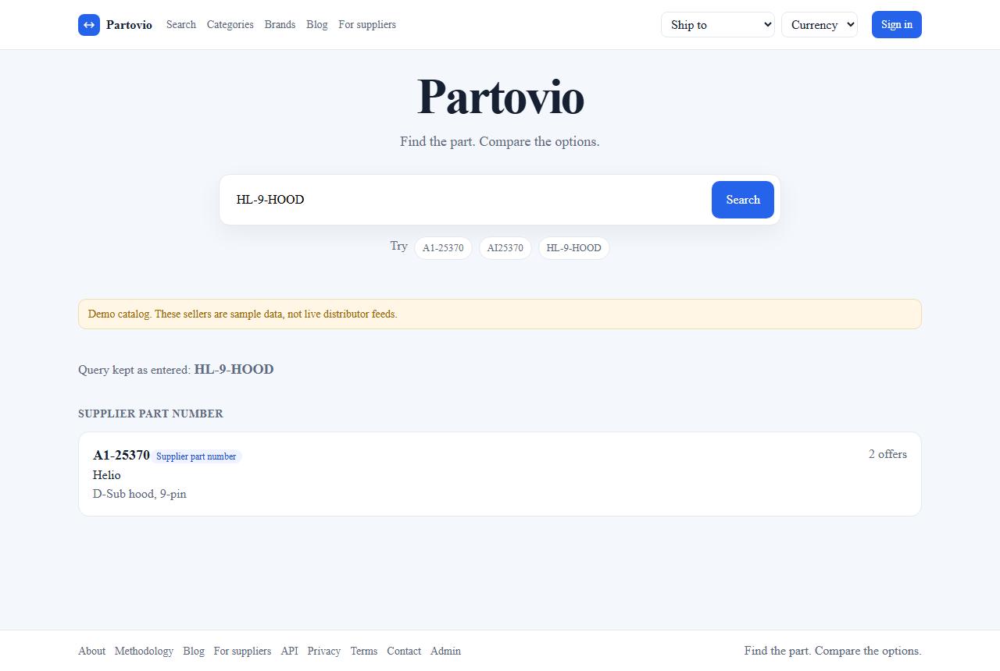
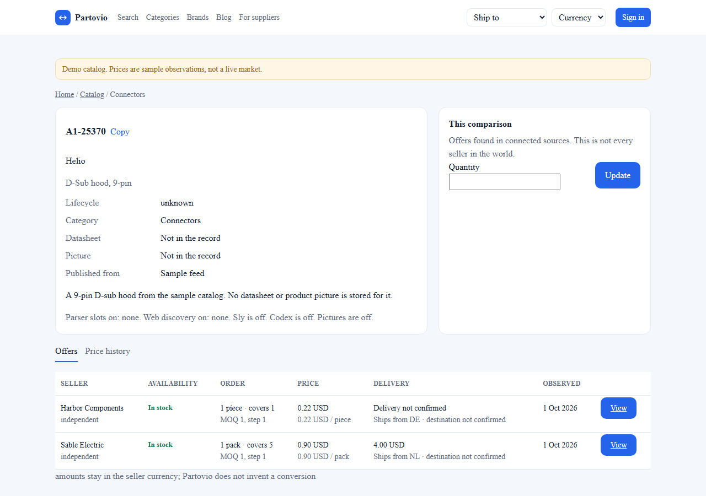
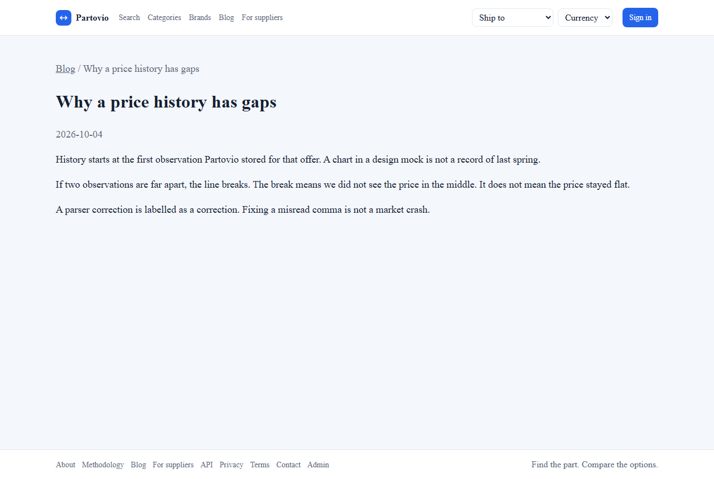
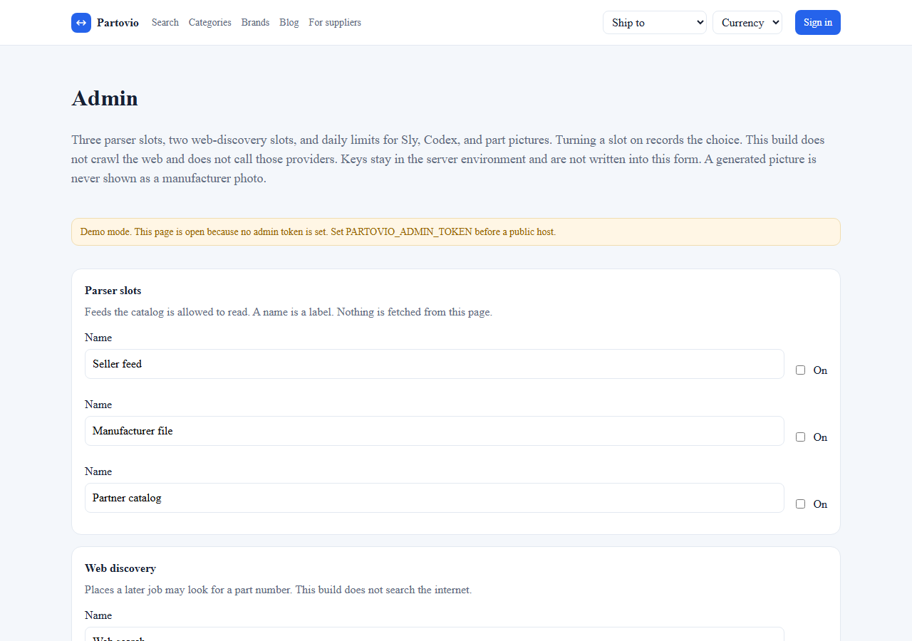

# Partovio web

Публичный сайт Partovio. Это поиск: строка на главной, выдача, карточка, предложения и история наблюдений. Каталог и цены приходят из приватного API, этот репозиторий к Mongo не подключается.

Репозиторий публичный, чтобы сборка на GitHub не расходовала минуты приватного ядра. Исходник сервиса на Go остаётся в приватном `partovio`. Публичность репозитория не является открытой лицензией.

Домен не зашит. `PARTOVIO_PUBLIC_ORIGIN` пустой, пока имя не зарегистрировано: тогда `robots` закрывает сайт, а sitemap пустой. Если витрину или домен позже разместит Lovable, этот Next.js остаётся самохостингом на Hetzner, а Lovable может держать только презентацию. Оба варианта ходят в один API. Адрес API задаёт `PARTOVIO_API_BASE`, в браузерные ссылки внутреннее имя контейнера не попадает. Переход к продавцу — это `/out/{offer}`, его забирает Nginx или локальный route.

## Интерфейс

Колонка одна на всех страницах. Короткий экран держит футер у нижнего края. Поиск живёт на главной: введённый запрос открывает список там же. Снимки сняты с демо-каталога, продавцы в них выдуманы.

### Главная



### Выдача на главной



### Карточка



### Блог



### Админка



На `/admin` задаются три слота парсера, два слота веб-поиска, дневные лимиты Sly, Codex и картинок деталей, тексты блога. Там же виден счётчик просмотров. В демо без `PARTOVIO_ADMIN_TOKEN` страница открыта. Ключи провайдеров в форму не входят. Включённый слот на этих снимках ничего не скачивает.

## Локально

```powershell
npm ci
npm run dev
```

API по умолчанию `http://127.0.0.1:8080`. Для демо ядра: `PARTOVIO_DEMO=1` и `go run ./cmd/api` в репозитории `partovio`. На страницах с демо-данными есть явная пометка. Логотипы реальных дистрибьюторов сюда не поставлены: их фиды не подключены.

## Образ для Hostwatch

```powershell
podman build -f Containerfile -t localhost/partovio-web:local .
```

Compose-проект `partovio` в приватном репозитории публикует сайт на `127.0.0.1:8092` и API на `127.0.0.1:8091`. Nginx на хосте разводит `/` и `/api`, `/mcp`, `/out`.

Переменные: `PARTOVIO_API_BASE`, `PARTOVIO_BRAND`, `PARTOVIO_PUBLIC_ORIGIN`, `PARTOVIO_DEMO`, `PARTOVIO_ADMIN_TOKEN`, `PARTOVIO_CONTACT_EMAIL`. Пустой токен в демо оставляет `/admin` открытой. Заданный токен сайт спрашивает и в страницу не кладёт.
